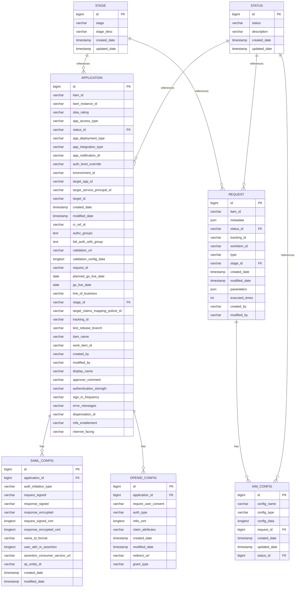

# Onboarding Schema - Relational Database Diagram

## Entity Relationship Diagram



---

## Table Relationships Summary

### Master Data Tables
- **status** - Reference table for all status values across the system
- **stage** - Reference table for all stage values in the workflow

### Core Transaction Tables
- **application** - Central table storing application onboarding information
- **request** - Stores request/workflow transactions for applications

### Configuration Tables
- **iam_config** - IAM (Identity & Access Management) configuration linked to requests
- **saml_config** - SAML authentication configuration for applications
- **openid_config** - OpenID Connect authentication configuration for applications

---

## Key Relationships

| From Table | To Table | Relationship | Type |
|---|---|---|---|
| `status` | `application`, `request`, `iam_config` | One-to-Many | Master-to-Detail |
| `stage` | `application`, `request` | One-to-Many | Master-to-Detail |
| `application` | `saml_config`, `openid_config` | One-to-Many | Parent-to-Child |
| `request` | `iam_config` | One-to-Many | Parent-to-Child |

---

## Foreign Keys & Constraints

### Explicit Foreign Keys
```sql
-- IAM Config to Request (CASCADE)
CONSTRAINT fk_iam_config_request 
  FOREIGN KEY (request_id) REFERENCES request (id) 
  ON DELETE CASCADE ON UPDATE CASCADE

-- IAM Config to Status (SET NULL)
CONSTRAINT fk_iam_config_status 
  FOREIGN KEY (status_id) REFERENCES status (id) 
  ON DELETE SET NULL ON UPDATE CASCADE

-- SAML Config to Application (CASCADE)
CONSTRAINT fk_saml_config_application 
  FOREIGN KEY (application_id) REFERENCES application (id) 
  ON DELETE CASCADE ON UPDATE CASCADE

-- OpenID Config to Application (CASCADE)
CONSTRAINT fk_openid_config_application 
  FOREIGN KEY (application_id) REFERENCES application (id) 
  ON DELETE CASCADE ON UPDATE CASCADE
```

### Implicit Relationships (String-based IDs)
- `application.status_id` → `status.id`
- `application.stage_id` → `stage.id`
- `request.status_id` → `status.id`
- `request.stage_id` → `stage.id`

---

## Indexes for Query Performance

### Application Table Indexes
- `idx_itam_id` - Search by ITAM identifier
- `idx_status_id` - Filter by status
- `idx_tracking_id` - Track application requests
- `idx_stage_id` - Filter by workflow stage
- `idx_created_date` - Time-based queries
- `idx_go_live_date` - Go-live date queries
- `idx_display_name` - Application name searches

### Request Table Indexes
- `idx_tracking_id` - Request tracking
- `idx_status_id` - Status filtering
- `idx_stage_id` - Stage filtering
- `idx_created_date` - Time-based queries
- `idx_workitem_id` - Work item lookups

### Configuration Table Indexes
- `idx_application_id` - Quick lookup by application
- `idx_sp_entity_id` (SAML) - Service provider entity lookups
- `idx_grant_type` (OpenID) - Grant type filtering
- `idx_request_id` (IAM Config) - Request lookups
- `idx_config_type` (IAM Config) - Config type filtering

---

## Data Flow

```
User/System
    ↓
REQUEST (Entry point)
    ├→ IAM_CONFIG (Config details)
    │   ├→ STATUS (Request status)
    │   └→ STAGE (Request stage)
    └→ STAGE (Request workflow stage)
    
APPLICATION (Core entity)
    ├→ STATUS (App status)
    ├→ STAGE (App stage in onboarding)
    ├→ SAML_CONFIG (SAML auth setup)
    └→ OPENID_CONFIG (OpenID auth setup)
```

---

## Entity Descriptions

### Status Entity
Master reference table storing all possible status values used across the system for applications, requests, and configurations.

### Stage Entity
Master reference table storing workflow stages (e.g., Initial, In Progress, Approved, Deployed, etc.)

### Application Entity
Central entity representing an application being onboarded. Contains comprehensive metadata about the application, its security requirements, integration details, and deployment information.

### Request Entity
Transactional record representing a request/task in the onboarding workflow for an application. Stores metadata and parameters for request execution.

### IAM Config Entity
Stores Identity & Access Management configuration details for specific requests, including configuration data and status tracking.

### SAML Config Entity
Stores SAML (Security Assertion Markup Language) authentication configuration for applications, including certificates, entity IDs, and assertion details.

### OpenID Config Entity
Stores OpenID Connect authentication configuration for applications, including consent requirements, grant types, and claim mappings.

---

## Views

### vw_application_details
Provides enriched application data with resolved status and stage names:
- Application ID, display name, ITAM identifiers
- Status name (resolved from status.id)
- Stage name (resolved from stage.id)
- Audit information (created_by, modified_by, dates)

### vw_request_details
Provides enriched request data with resolved status and stage information:
- Request ID, tracking ID, type
- Status name (resolved from status.id)
- Stage name (resolved from stage.id)
- Audit information (created_by, dates)
